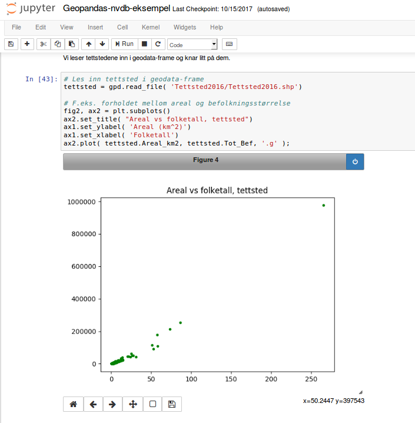
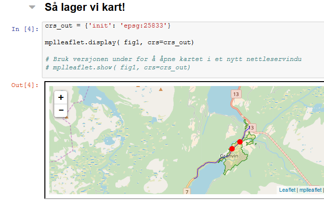

# Bruk av geopandas med data fra NVDB og SSB

Demo av hvordan geopandas kan brukes med data fra [Nasjonal vegdatabank](https://www.vegvesen.no/fag/teknologi/Nasjonal+vegdatabank) (NVDB) og [Statistisk Sentralbyrå](http://www.ssb.no/natur-og-miljo/geodata) (SSB). 

Vi ønsker å finne hvilke turistveger som går gjennom hvilke tettsteder - og hvilke trafikkulykker som er registrert der. Til dette bruker vi [Geopandas](http://geopandas.org/), som gir oss geografiske operasjoner i Pandas -- som er Pythons svar på analysemetodene i R og Matlab. Interaktiv datautforskning og analyse er spesielt gøy i såkalte [jupyter notebooks](https://ipython.org/notebook.html). Man kan selvsagt også kjøre funksjonene på vanlig vis i python interpreter / IDE. 

## Kom i gang 

[Installasjon](installasjon.md) 

# Screenshots

