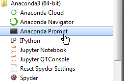

# Windows-brukere - hent fram anaconda prompt

Last ned og installer siste [Anaconda versjon](https://www.anaconda.com/download) for python 3.6 eller høyere. 

Start **anaconda prompt** : Start -> Alle programmer -> Anaconda 3 -> Anaconda prompt. 



Dette er en windows kommandolinje med litt utvidede funksjoner. Du bruker **anaconda prompt** til å kjøre kommandoene for å installere de bibliotekene som trengs.  

### Føy til bibliotekene som trengs

Linux-brukere kjører dette i et vanlig shell, windows brukere henter fram **anaconda prompt** 

```
conda install -c conda-forge geopandas
conda install -c conda-forge geojson
conda install -c conda-forge mplleaflet
```

Mange anbefaler også å lage 
[virituelle anaconda-miljøer](https://conda.io/docs/user-guide/tasks/manage-environments.html) 
der man installerer det som trengs til en type oppgaver. Da minimerer du 
risikoen for at et bibliotek henten fra ett sted slår i hjel noe annet du 
er avhengig av. _Jeg har vært litt plundrete uheldig med mine forsøk i den retning 
(notisboka fant ikke bibliotekene i det virituelle miljøet), men oppdaterer 
gjerne når jeg finner en mer skuddsikker oppskrift._

# Surr film!

Reposet finner du her: https://github.com/LtGlahn/geopandas_ssb_nvdb_demo. 
Den mest elegante oppskriften er jo å bruke git i kommandolinjen:  

```git clone https://github.com/LtGlahn/geopandas_ssb_nvdb_demo```

Eller du kan laste ned denne [zip-fila](https://github.com/LtGlahn/geopandas_ssb_nvdb_demo/archive/master.zip) og pakke ut et passende sted. 

Start notebook, naviger til riktig mappe og åpne et av ```.ipynb``` - eksemplene. Velg "Cell -> Run all"

Notebook kan startes på flere måter: 
* Fra anaconda prompt (eller linux shell): ```jupyter notebook```
* Fra anaconda navigator 
* Fra programmenyen (Start -> Alle programmer -> Anaconda3 -> Jupyter notebook)

